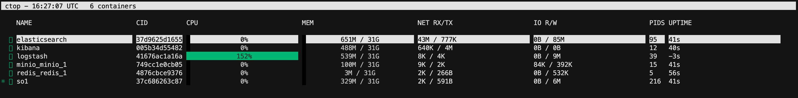

COS - Cribl On a Stick
============
-------
Summary
-------
The intent behind this project is to facilitate the Cribl Suite deployment initially during POVs, bypassing environment challenges and to create a modular (customizable) single source of Cribl configurations adding speed and consistency on POV engagements.

The project basically uses Terraform provisioning the infrastructure currently on AWS and Azure Cloud providers. It also uses Ansible as the deployment tool of choice and Docker containers for the “Satellite Services” (Splunk, ELK, etc.)

###Current status:

#### Deploying to Azure:
* 1 Leader node
* N worker nodes (connected not configured)
* POV user (povadmin)
* Azure load balancer (front end IP only)

#### Deploying on AWS
* 1 Leader Node
* N Worker nodes (connected not configured)
* Creates a aws_key_pair for SSH use
* Creates a POV user (povadmin) capable to ssh to all EC2 instances via SSH with root privileges.
* ELB with the EC2 instances on the Target Group
* S3 bucket with IAM policy applied to the POV user (povadmin)
* 1 Satallite Box. An EC2 instance to host all peripheral services.

#### Deploying on Docker
* Splunk deployment, single instance. 
* Elastic deployment with Elasticserch, Kibana, and Logstash. 
* MinIO (Selective via variables)
* REDIS server (Selective via variables)
* All containers added to the same network
* Rsyslog forking data to the Workers

#### Authentication on Cloud Providers
All RSA keys generated are ignored by .gitignore these cases are created during runtime
All user accounts, access keys, secret keys are also excluded by .gitignore
the file .env within the Docker deployments has a sample password that should be changed manually if used in public environments.

## To Do List
* Define configurable options for VPC, Subnet, IAM user and Policies (currently using AdministratorAccess)
* Currently deployed to an Ubuntu AMI, needs to create a dynamic selection, via terraform.tfvars, for AWS_Linux, CentOS and RHEL.
* Create a script to calculate the size of the Cribl environmet base on IN and OUT ingestion
* Create a web interface to gather all environment variables (questionnaire, use cases, sources, destinations, etc.)
* Create a template for all Cribl yaml files with configurations related to the deployment and copy them to its components during deployment (Ansible)
* Create Splunk and Kibana dashboards with results for the POV 
* Create better documentation for each function
* Add VSPhere deployment
* Add GCP deployment
* Create a full Ansible deployment for on_prem deployments.
---
##How to Start?
On all Cloud platforms we use Terraform, Ansible and Docker.
You will need to install these components on your local host machine (or a deployer configured on the Cloud)/
Install these components: 
1. **Terraform:** https://learn.hashicorp.com/tutorials/terraform/install-cli
2. **Ansible:** https://adamtheautomator.com/install-ansible/
3. **Ansible on Windows:** https://phoenixnap.com/kb/install-ansible-on-windows
4. **Docker:** https://docs.docker.com/engine/install/

###AWS
Terraform providers will be installed upon running 'terraform init' for the first time.
Current dependencies (also installed with terrform init) used accross the AWS solution:

- hashicorp/local v2.2.3
- hashicorp/aws v4.31.0
- ashicorp/null v3.1.1
- hashicorp/tls v4.0.1

### Structure
```bash.
├── .terraform
│   ├── modules
│   │   └── modules.json
│   └── providers
│       └── registry.terraform.io
│           └── hashicorp
│               ├── aws
│               │   ├── 4.24.0
│               │   │   └── darwin_amd64
│               │   │       └── terraform-provider-aws_v4.24.0_x5
│               │   └── 4.26.0
│               │       └── darwin_amd64
│               │           └── terraform-provider-aws_v4.26.0_x5
│               ├── local
│               │   └── 2.2.3
│               │       └── darwin_amd64
│               │           └── terraform-provider-local_v2.2.3_x5
│               ├── null
│               │   └── 3.1.1
│               │       └── darwin_amd64
│               │           └── terraform-provider-null_v3.1.1_x5
│               └── tls
│                   ├── 4.0.1
│                   │   └── darwin_amd64
│                   │       └── terraform-provider-tls_v4.0.1_x5
│                   └── 4.0.3
│                       └── darwin_amd64
│                           └── terraform-provider-tls_v4.0.3_x5
├── README.md
├── ansible
│   ├── ansible.cfg
│   ├── configleader.yaml
│   ├── deployelk.yaml
│   ├── deployleader.yaml
│   ├── deployminio.yaml
│   ├── deployredis.yaml
│   ├── deploysatellite.yaml
│   ├── deploysplunk.yaml
│   ├── deploysplunkidxc.yaml
│   ├── deploywrks.yaml
│   ├── roles
│   │   ├── cribl
│   │   │   ├── files
│   │   │   │   ├── License
│   │   │   │   ├── LicenseKey.yml
│   │   │   │   └── out.j2
│   │   │   └── tasks
│   │   │       └── main.yml
│   │   ├── elastic
│   │   │   ├── files
│   │   │   │   ├── .env
│   │   │   │   ├── docker-compose.yml
│   │   │   │   ├── logstash
│   │   │   │   │   └── logstash.conf
│   │   │   │   └── logstash\ 2
│   │   │   └── tasks
│   │   │       └── main.yaml
│   │   ├── leader
│   │   │   └── tasks
│   │   │       └── main.yaml
│   │   ├── minio
│   │   │   ├── files
│   │   │   │   └── docker-compose.yml
│   │   │   └── tasks
│   │   │       └── main.yaml
│   │   ├── redis
│   │   │   ├── files
│   │   │   │   └── docker-compose.yaml
│   │   │   └── tasks
│   │   │       └── main.yaml
│   │   ├── satellite
│   │   │   └── tasks
│   │   │       └── main.yaml
│   │   ├── splunk
│   │   │   ├── files
│   │   │   │   └── docker-compose.yml
│   │   │   └── tasks
│   │   │       └── main.yaml
│   │   └── workers
│   │       └── tasks
│   │           └── main.yaml
│   └── tf_ansible_vars_file_sample.yml
├── ansible.cfg
├── calcsize.sh
├── cribl
│   ├── cribl.tgz
│   ├── main.tf
│   └── variables.tf
├── docker_env.tf
├── inventory.tmpl
├── lb.tf
├── ldinstall.sh
├── leader.tf
├── main.tf
├── movefiles.sh
├── outputs.tf
├── policies.tf
├── povadmin.sh
├── s3_bucket.tf
├── sec_groups.tf
├── terraform.tfvars
├── terraform.tfvars.sample
├── tf_ansible_vars.tf
├── variables.tf
└── workers.tf
```
#### Content

1. From this Git repo, under the /AWS folder, download the 'terraform.tfvars.sample file and edit with your AWS Account and Secret keys. Save this file to the /AWS directory level.

```js
region                = "us-west-2"
access_key            = "ACCESS KEY"
secret_key            = "SECRET KEY"
lb_create             = true
leader_count          = 1
workers_count         = 1
worker_group          = "POV"
worker_size           = "t3.micro"
ec2_OS                = "ubuntu"
ec2_instance_user     = "povadmin"
satellite_box_size    = "t3.2xlarge"
satellite_disk_size   = 65
satellite_box         = true
splunk                = false
elk                   = false
redis                 = false
minio                 = false
syslog_port_tcp       = 9514
syslog_port_udp       = 9514
splunk_receiving_port = 9997
username              = "povadmin"
cribl_pass            = "passtest"
splunk_user           = "admin"
splunk_passwd         = "passtest"
elastic_user          = "elastic"
elastic_passwd        = "passtest"
```
2. On your local host (with Terraform installed) in the target directory to be deployed (AWS, Azure, etc.) run: 

```sh
terraform init
```
Expect the following output
```sh
Initializing the backend...

Initializing provider plugins...
- Reusing previous version of hashicorp/tls from the dependency lock file
- Reusing previous version of hashicorp/local from the dependency lock file
- Reusing previous version of hashicorp/null from the dependency lock file
- Reusing previous version of hashicorp/aws from the dependency lock file
- Using previously-installed hashicorp/aws v4.26.0
- Using previously-installed hashicorp/tls v4.0.1
- Using previously-installed hashicorp/local v2.2.3
- Using previously-installed hashicorp/null v3.1.1

Terraform has been successfully initialized!

You may now begin working with Terraform. Try running "terraform plan" to see
any changes that are required for your infrastructure. All Terraform commands
should now work.

If you ever set or change modules or backend configuration for Terraform,
rerun this command to reinitialize your working directory. If you forget, other
commands will detect it and remind you to do so if necessary.
```
3. Prepare a Terraform Plan for the first run by running
```sh
terraform plan
```
4. If no errors are displayed start Terraforming to the AWS account provided in the terraform.tfvars file
```sh
terraform apply -auto-approve
```
5. Once the Terraform scripts start to run the initial provision and deployment should take arround 5 mins.
> **NOTE**
> When running Terraform on MAC OS you recieve an Error message as:

```error 
│ objc[16402]: +[__NSCFConstantString initialize] may have been in progress in another thread when fork() was called. We cannot safely call it or ignore it in the fork() child process. Crashing
│ instead. Set a breakpoint on objc_initializeAfterForkError to debug.
│ ERROR! A worker was found in a dead state
```
> Apply the following command form your CLI:
```sh
export OBJC_DISABLE_INITIALIZE_FORK_SAFETY=YES
```
OR
Edit your bash profile with:
```sh
~/.bash_profile works.
export DISABLE_SPRING=true
```
If Terraform completed successfully a Output will be printed. Save this information to access your POV environment:
```js
Leader_public_ip_address = "44.229.11.189"
Load_Balancer = "some--lb-name"
S3_Bucket = "some-pov-bucket"
Satellite_Server = "44.234.47.18"
Workers = [
  [
    "35.86.0.144",
    "44.234.20.245",
  ],
]
tls_private_key = <sensitive>
vpc_id = "vpc-025f32a59a3b71b80"
```
## The Satellite Box

The Satellite Box is a EC2 instance with a Docker deployment that will create containers dynamically based on the selection made from the terraform.tfvars

```js
satellite_box_size = "t3.2xlarge"
satellite_box     = true
splunk            = false
elk               = false
redis             = false
minio             = false
```
All configurations are done via Ansible using Roles.The roles are composed by 2 directories files and tasks
files contains configuration items and the docker-composer.yml (that depends on the container being deployed) and tasks contains the ansible yaml file responsible to copy files and initiate the docker-composer.yml remotely.

Terraform will run the initial Ansible file calling each deployment in roles.
All Ansible files are stored in the /ansible directory which holds all components needed to the deployment phase on each container as well as in other configuration tasks (ie. configleader.yaml). The ansible folder also sotores the Cribl vars and terraform variables (stored in Jinja templates forcapture during the provisioning of the infrastructure to be used dynamically on deployment via Ansible.

The satallite box is called from the docker_env.tf in Terraform. This script performs provisional tasks on the target host and calls the Ansible playbook '/ansible/deploysatellite.ymal' which will start the deployment of Docker and all necessary packeges needed to run the Satallite box with any given selection from 'terraform.tfvars'file. These options can be deployed as needed withouth losing the existing containers already deployed to the Satellite Box.

#### Structure:

```bash

ansible
├── ansible.cfg
├── configleader.yaml
├── deployelk.yaml
├── deployleader.yaml
├── deployminio.yaml
├── deployredis.yaml
├── deploysatellite.yaml
├── deploysplunk.yaml
├── deploysplunkidxc.yaml
├── deploywrks.yaml
├── roles
│   ├── .DS_Store
│   ├── cribl
│   │   ├── files
│   │   │   ├── License
│   │   │   ├── LicenseKey.yml
│   │   │   └── out.j2
│   │   └── tasks
│   │       └── main.yml
│   ├── elastic
│   │   ├── files
│   │   │   ├── .env
│   │   │   ├── docker-compose.yml
│   │   │   ├── logstash
│   │   │   │   └── logstash.conf
│   │   │   └── logstash\ 2
│   │   └── tasks
│   │       └── main.yaml
│   ├── leader
│   │   └── tasks
│   │       └── main.yaml
│   ├── minio
│   │   ├── files
│   │   │   └── docker-compose.yml
│   │   └── tasks
│   │       └── main.yaml
│   ├── redis
│   │   ├── files
│   │   │   └── docker-compose.yaml
│   │   └── tasks
│   │       └── main.yaml
│   ├── satellite
│   │   └── tasks
│   │       └── main.yaml
│   ├── splunk
│   │   ├── files
│   │   │   └── docker-compose.yml
│   │   └── tasks
│   │       └── main.yaml
│   └── workers
│       └── tasks
│           └── main.yaml
└── tf_ansible_vars_file_sample.yml
```
Within the Satellite Box some tools, packages and configurations were provided. An easy way to validate your containers status and healthy can be achieved by running the provided 'ctop' command. 



If you prefer a more detail overview of the Docker Containers deployed to the Satellite Box run the following command from your Satellite Box's CLI:

```bash
$ docker ps --format "table {{.ID}}\t{{.Names}}\t{{.Image}}\t{{.Ports}}"
```
Expected Results:
```bash
CONTAINER ID   NAMES           IMAGE                  PORTS
005b34d55482   kibana          kibana:7.16.2          0.0.0.0:5601->5601/tcp, :::5601->5601/tcp
41676ac1a16a   logstash        logstash:7.16.2        5044/tcp, 0.0.0.0:9600->9600/tcp, :::9600->9600/tcp
37c686263c87   so1             splunk/splunk:latest   8065/tcp, 0.0.0.0:8000->8000/tcp, :::8000->8000/tcp, 8088/tcp, 8191/tcp, 0.0.0.0:8089->8089/tcp, :::8089->8089/tcp, 0.0.0.0:9997->9997/tcp, :::9997->9997/tcp, 9887/tcp
37d9625d1655   elasticsearch   elasticsearch:7.16.2   0.0.0.0:9200->9200/tcp, :::9200->9200/tcp, 0.0.0.0:9300->9300/tcp, :::9300->9300/tcp
749cc1e0cb05   minio_minio_1   minio/minio            0.0.0.0:9000-9001->9000-9001/tcp, :::9000-9001->9000-9001/tcp
4876cbce9376   redis_redis_1   bitnami/redis:7.0      0.0.0.0:6379->6379/tcp, :::6379->6379/tcp
```


### Azure

#### Content
